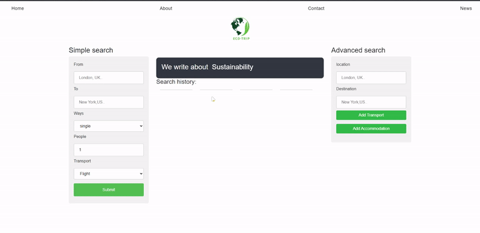
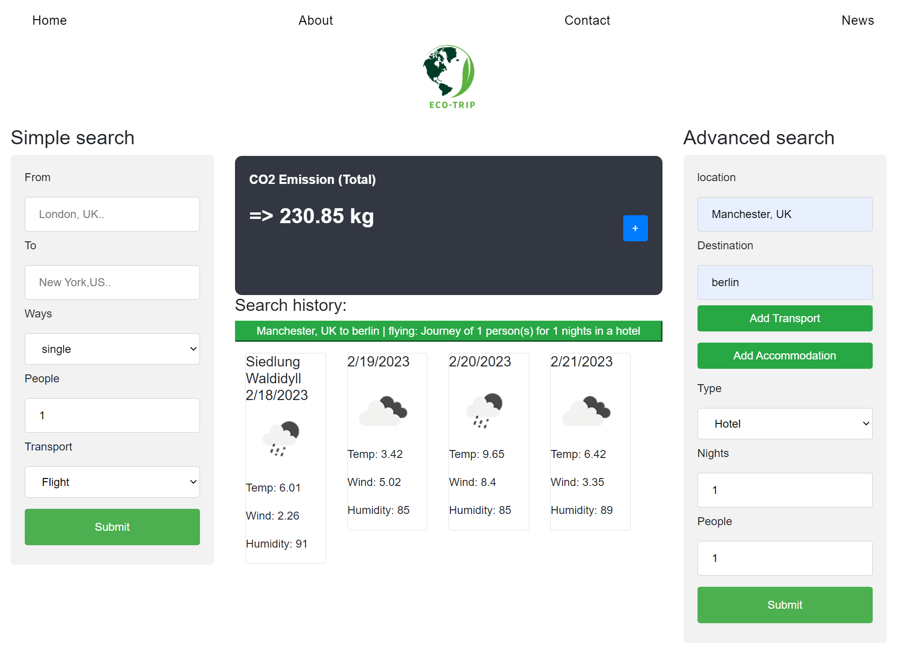

# Eco-trip: Making every mile counts

## Description 
Eco-trip is a web based app that allows users estimate and keep track of the amount of Carbon emitted for trips between any two cities of the world, including the current and 3 days forecast weather condition for the destination city, built with HTML, CSS, Jquery, moment.js and two server APIs. 

The two server APIs implemented are Travel CO2 and Open weather API. 

The practical benefits of this app is that it keeps people in a state of awareness of their environmental impact, so that they can make responsible choices in planning for trips. 

## App screen shot
.png)

## App Features
Follow the [App url](https://marilena-c.github.io/Travel-Planner_Project1). You will land on the home page displayed above. The App has two search field, namely the Simple and Advanced search. The simple search returns carbon emission between any two cities based on user's transport options. Meanwhile, the advanced provides both transport and accommodation options for trips searched. 
When a user clicks on a trip in the search history they are again presented with the results for that trip. Thus, helping them compare searches. 

The picture below shows the app in active use:
#### Home Page/About

#### Advanced search

## Reflection
This was a group project built during our 9th week at the UoB bootcamp in FE web development. 

The main project goal was to build an interactive, polished and responsive web app that uses at least two server APIs. 

The main challenge on this project was organising our code development via github. As it was our first collaborative project, we initially struggled engaging github collaboration features and did run into problems with our repo. However, with intervention from instructors and personal and collaborative research, we overcame that initial struggle. Also, we did spend a lot of time on deciding what specific API to implement, which stole from our development time. Meanwhile, with great team spirit, we did redeem time. 

in future project, we will strive to make technical decisions (such as server API to use, or js library) early on, so that we can craft and solidify our project ideas properly before actual development. 

## Upcoming features 
To extend the functionality of this app, we plan to implement;
1. A feature that allows user book flights and view airports within certain radius mile of their destination city
2. A news blog post that provides news articles and other informational materials on sustainability and climate change.
3. Recommendation feature that suggest best methods of travel based on user's need, journey type, duration etc. 

 ## Links
GitHub repository: https://github.com/Marilena-C/Travel-Planner_Project1

Deployed website: https://marilena-c.github.io/Travel-Planner_Project1

Shared document: https://docs.google.com/document/d/1JOK6MxFs2SGy3WISj3TDsynwZspP2SCjuxc8IKcKR6k/edit
